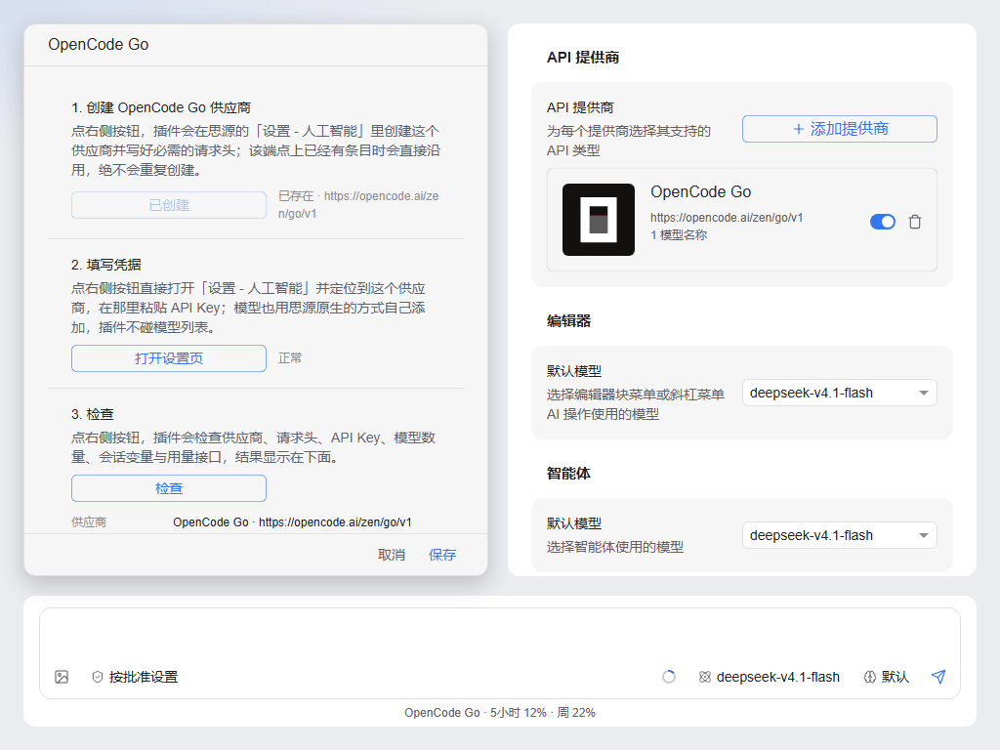

# OpenCode Go for SiYuan

[English](README.md) · **简体中文**

把 [OpenCode Go](https://opencode.ai/docs/go/) 订阅接入思源笔记自身 AI 设置页的插件。



## 功能

- **原生供应商。** 在「设置 - 人工智能」里加入一个 `OpenCode Go` 供应商，指向官方
  `https://opencode.ai/zen/go/v1` 的 Chat Completions 端点并使用官方图标。它就是一个普通供应
  商：可以直接在原生页面里改名、填 key、增删模型、停用或删除。
- **逐会话的 `x-opencode-session`。** OpenCode Go 会拒绝缺少该请求头的请求（`400
  MissingSessionID`，而且这个检查发生在鉴权之前），并要求每段对话使用稳定的 ID，以便它优化路由
  与提示词缓存。思源内核只支持静态请求头，因此插件在请求离开客户端**之前**，把该对话自己的 ID 写
  进 `OPENCODE_GO_SESSION` 变量。
- **用量。** 5 小时（滚动窗口）、周、月三个百分比：既在插件设置面板里展示，也以一行文本出现在智
  能体输入框下方；点击该行可打开详情窗口，里面有三个窗口的进度条、重置倒计时，以及当前端点、模型、
  会话 ID 和错误详情。

## 环境要求

- 思源 **3.8.5** 及以上。插件用到的每个接口都已核对在 `v3.8.5` 标签上存在：`Provider.Headers`、
  `ResolveAIProviderHeaders`、`/api/setting/setVariables`、`/api/ai/listModels`、
  `window.siyuan.config.variables`。
- 已订阅 OpenCode Go，并在 <https://opencode.ai/auth> 取得 API Key。

## 安装

1. 从最新 Release 下载 `package.zip`。
2. 解压到 `<工作空间>/data/plugins/opencode-go-siyuan/`，确认 `plugin.json` 直接位于该目录下。
3. 在「设置 - 集市 - 已下载」中启用插件。

## 使用

1. 启用插件后，它会自动在「设置 - 人工智能」里创建供应商（可在插件设置里关闭）。
2. 打开「设置 - 人工智能 - OpenCode Go」，填入 API Key。
3. 在智能体的模型选择器里选一个模型即可开始对话。

## 会话请求头是怎么实现的

内核会在**每个请求**上解析供应商请求头里的 `{{vars.NAME}}` 占位符，所以注入的供应商带的是：

```json
"headers": {
  "x-opencode-session": "{{vars.OPENCODE_GO_SESSION}}",
  "User-Agent": "siyuan-opencode-go/0.1.0"
}
```

在发往 `/api/ai/agent/chat`（以及 `/api/ai/editor/chat`）的请求离开客户端之前，插件从请求体里读
出 `sessionID`（编辑器对话是 `taskID`），如果与变量里的值不同就先写变量，然后才放行。因此首轮就是
正确的，并在整段对话里保持一致。

**已知限制：** 思源内核自身无法逐请求注入请求头。插件因此使用变量通道，外加一个范围极窄的
`window.fetch` 拦截；`onunload` 会还原 `fetch`，写变量失败时会按原值放行——变量缺失或陈旧时，请求
头仍然是**非空**的，所以绝不会被 `400` 拒绝，只是损失一部分缓存亲和性。关闭「按会话发送」后，所有
请求统一使用安装级 ID。

## 设置项

| 设置项 | 默认 | 含义 |
| --- | --- | --- |
| 自动注入 OpenCode Go 供应商 | 开 | 在原生 AI 设置页里创建并维护该供应商。 |
| 修复供应商配置 | — | 补齐缺失的必需请求头与端点字段、清理 API Key 里的空白/零宽字符；供应商被你删掉时会重建（同端点已有条目则直接接管，不重复创建）。 |
| 刷新模型列表 | — | 通过思源原生的模型列表接口重新获取模型。 |
| 按会话发送 `x-opencode-session` | 开 | 在请求发出前写入该对话自己的 ID。 |
| 静态会话 ID | 空 | 上一项关闭时使用；留空会自动生成安装级 ID。 |
| User-Agent 策略 | 内核 | 沿用思源内核、使用插件标识，或自定义。 |
| 自定义 User-Agent | 空 | 仅在策略为自定义时生效。 |
| 在输入框下方显示用量 | 开 | 输入框下方那行 `OpenCode Go · 5小时 n% · 周 n%`。 |
| 用量刷新间隔 | 300 秒 | 30 – 3600 秒；打开设置页或详情窗口时会强制刷新一次。 |
| 手动刷新用量 | — | 立即查询一次用量接口。 |
| 调试日志 | 关 | 在开发者工具输出带前缀的诊断日志，绝不包含 API Key。 |

设置面板里还有一块只读自检：供应商是否命中官方端点、哪些必需请求头缺失或取值不同、是否已填 key
（以及 key 里是否混进了非 ASCII 字符）、模型数量、当前会话 ID 与最近一次用量结果。

在「设置 - 人工智能」里手动删除该供应商后，插件会记住「自己创建的那个 id 已经不在了」，不再把卡片
放回来；只有点「立即修复」或把「自动注入 OpenCode Go 供应商」关掉再打开，才会重建。

## 说明与限制

- 用量接口 `GET https://opencode.ai/zen/go/v1/usage` 是 OpenCode 自己的第一方路由，但**没有写入
  官方文档**，且上线当天改过一次响应形态。插件按防御式解析：缺字段一律当作「未知」而不是 0，并且会
  丢弃某个窗口为 0% 时上游给出的占位重置时间。
- 该接口每个窗口只返回一个聚合百分比；官方文档描述的限额是按模型的，所以具体某个模型的数字可能与
  console 页面不完全一致。
- 模型条目的上游模型名使用裸 id（例如 `deepseek-v4.1-flash`）。
- API Key 必须是可打印 ASCII。空白、零宽字符和 BOM 会被自动清掉（它们正是让 `fetch` 直接报
  *String contains non ISO-8859-1 code point*、让网关回 *Invalid API key.* 的原因），但其它非
  ASCII 字符只能重新粘贴一次；设置页自检会指出具体是第几位。
- 思源自带的「测试连接」按钮（「设置 - 人工智能」里）只要 `/v1/models` 有响应（该接口不需要 key），
  就会把它那次一次性的补全请求的**任何**失败都显示成「该模型不在可用模型列表中」，所以 key 缺失或
  被拒在它那里看起来像模型问题。真实原因请看插件输入框下方的用量行与设置页自检。
- `User-Agent` 通过供应商请求头注入。若未来内核覆盖了它，可切换策略，或直接在「设置 - 人工智能 -
  OpenCode Go - 请求头」里改写。
- 插件不会把 API Key 写进日志、提示或 DOM；用量请求只使用供应商配置里已存的 key。
- `OPENCODE_GO_SESSION` 会出现在「设置 - 密钥和变量」里。插件负责维护它，并在卸载插件时删除；手动
  删除只会损失缓存亲和性，不会导致请求被拒。
- 暂未提交到思源集市。

## 开发

```bash
npm install
npm run dev        # 监听构建，产物落在仓库根目录
npm run typecheck  # tsc --noEmit
npm run build      # 生成 dist/ 与 package.zip
npm run icon       # assets/icon.svg  -> assets/icon.png（160x160，<= 64 KiB）
npm run preview    # assets/preview.html -> assets/preview.png（1024x768，<= 512 KiB）
```

`npm run preview` 通过 Playwright 驱动 Chromium；若浏览器缺失，先执行一次
`npx playwright install chromium`。

## 许可与赞助

基于 [MIT 许可证](LICENSE) 开源。如果这个插件对你有帮助，可以在
<https://afdian.com/a/wmy2981> 支持作者。
